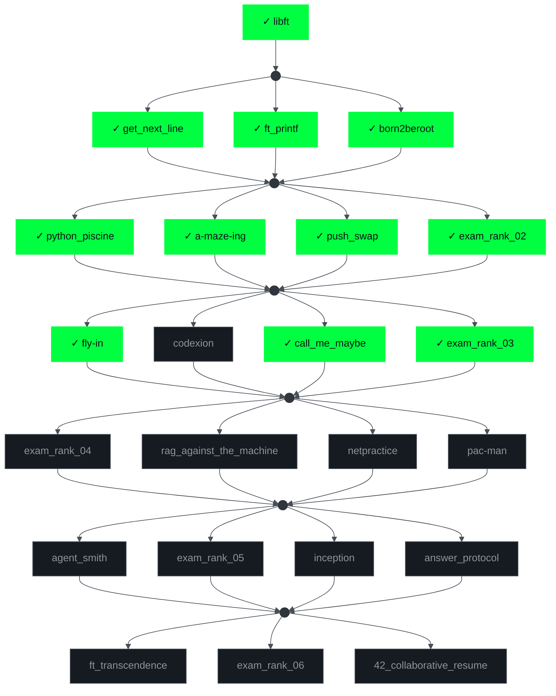

<h1 align="center">
  
</h1>

  <i>Software Engineering Student | Problem Solver | Clean Code Advocate</i>

  
  
  
  

  

💻 Passionate about building clean, efficient, and maintainable software

---

## 🚀 About Me
I am a software engineering student with a strong foundation in programming fundamentals and problem-solving.  
My focus is on writing **clean code**, understanding **core concepts deeply**, and continuously improving my technical skills.

I value discipline, consistency, and simplicity in software development.

  

---

## 🛠️ Technical Stack

### Programming Languages

  

### Tools & Environment

  

---
## 42 Cursus

---

## 📫 My contacts

---

## 📚 Education

- 🎓 **Software Engineering Student**  
  **UM6P | 1337 Coding School**

- 👩‍🏫 **High School Mathematics Teacher**  
  **Bachelor’s Degree in Education – Secondary Mathematics**  
  **École Normale Supérieure (ENS), Tétouan**
  
---

## 🎯 Focus Areas
- Algorithms & data structures  
- Software engineering fundamentals  
- Linux environment & low-level understanding  
- Writing readable, maintainable code  

---

## 🧠 Learning Philosophy
> *"Master the fundamentals first. Tools change, principles remain."*

I believe strong foundations are the key to long-term growth in software engineering.

---

## 📌 In Short
- 🎓 Software engineering student  
- 💡 Focused on fundamentals and clean code  
- 🧩 Problem-solving mindset  
- 🌱 Constant learner  

---

### ✍️ Random Dev Quote:

  

